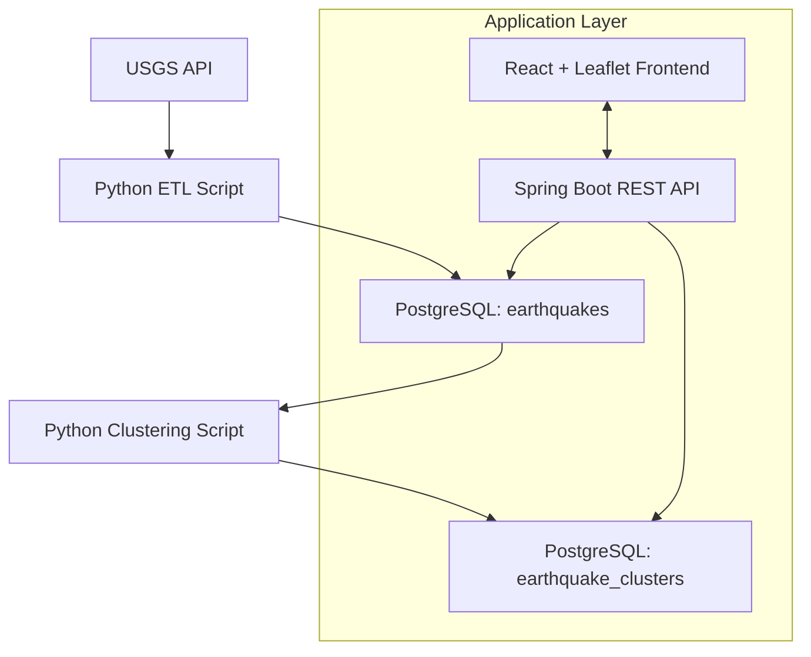

# GeoSight: Earthquake Visualization Platform

GeoSight Lite is an interactive full-stack web platform that visualizes recent earthquake data from the USGS. It identifies earthquake hotspots using clustering algorithms and provides a clean, intuitive map interface for exploring seismic activity.

---

## Core Features

- **Interactive Earthquake Map** – Shows earthquakes from the last 30 days
- **Filtering** – By magnitude, date range, and region
- **Hotspot Detection** – K-means clustering to identify earthquake clusters
- **Map Interface** – Leaflet-powered visualization with zoom, pan, and click-to-view details
- **Simple UI** – Clean, minimal interface for data exploration

---

## Tech Stack

### Frontend

- **React** – UI framework
- **Leaflet.js** – Geospatial visualization
- **TailwindCSS** – Utility-first styling
- **Axios** – API communication
- **React Hooks** – `useState`, `useEffect` for state management

### Backend

- **Java Spring Boot** – REST API framework
- **Spring Data JPA** – ORM layer
- **Spring Web** – RESTful services
- **Maven** – Dependency management
- **Jackson** – JSON (de)serialization

### Database

- **PostgreSQL** – Stores earthquake and cluster data
- **HikariCP** – Connection pooling
- **Spatial Queries** – Distance-based filtering

### Data Processing & Clustering

- **Python** – ETL & clustering logic
- `requests`, `pandas`, `numpy` – Data fetching & cleaning
- `scikit-learn` – K-means clustering
- `psycopg2` / `SQLAlchemy` – PostgreSQL connectivity

### External APIs

- **USGS Earthquake API** – Real-time earthquake data

---

## Database Design

### Tables:

- **`earthquakes`** – Stores earthquake records
- **`earthquake_clusters`** – Stores hotspot clusters

---

## System Architecture



## 🛠️ Setup Instructions

Follow these steps to get the project running after cloning the repository.

### 1. Clone the repository

```bash
git clone https://github.com/Akashew/GeoSight.git

cd GeoSight
```

### 2. Set up the Python environment (for data processing and clustering)

```bash
python -m venv venv

# On Windows:
venv\Scripts\activate

# On macOS/Linux:
source venv/bin/activate

pip install -r requirements.txt
```

### 3. Run the backend

```bash
cd backend

mvn clean spring-boot:run
```

### 3. Run the frontend

```bash
cd frontend

npm install

npm run dev
```
